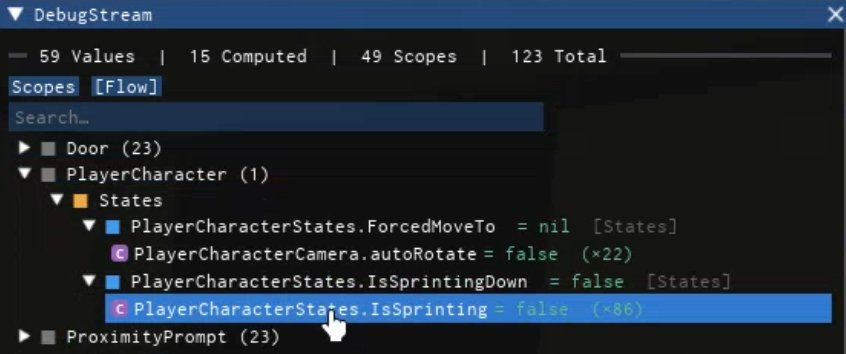

<div align="center">

# Stream

**A reactive state library for Roblox**

[Documentation](https://TylerAtStarboard.github.io/Stream
) · [Example Place](StreamExamplePlace.rbxl)

---

</div>

Stream gives you **values** that hold state, **computeds** that derive from them automatically, and **scopes** that clean everything up when you're done. It also ships with a built-in [Iris](https://github.com/SirMallard/Iris) debugger for inspecting your reactive graph at runtime.

<div align="center">

</div>

## Quick Example

```luau
local Stream = require(ReplicatedStorage.Stream)

local scope = Stream.Scope("UI", "HealthBar")

local hp = scope:Value(100)
local label = scope:Computed(function()
    return hp:get() .. " HP"
end)

scope:Bind(textLabel){
    Text = label,
}

hp:set(75) -- textLabel.Text updates to "75 HP"

scope:Destroy() -- cleans up everything
```

## Installation

### Wally

Add to your `wally.toml`:

```toml
[dependencies]
Stream = "TylerAtStarboard/stream@1.0.0"
```

Then run:

```sh
wally install
```

### GitHub Releases

Download the latest `.rbxm` from [Releases](https://github.com/yourusername/stream/releases) and drop it into your project.

### Example Place

Open `StreamExamplePlace.rbxl` in Studio to see Stream in action with the debugger enabled.

## Documentation

Full API reference, examples, and debugger guide:

**[https://yourusername.github.io/stream](https://yourusername.github.io/stream)**

## License

[MIT](LICENSE)
